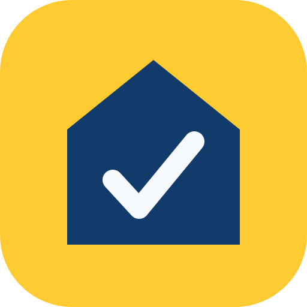
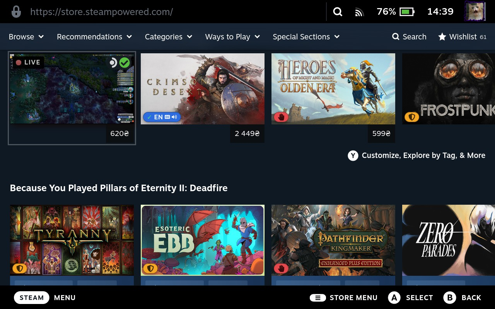
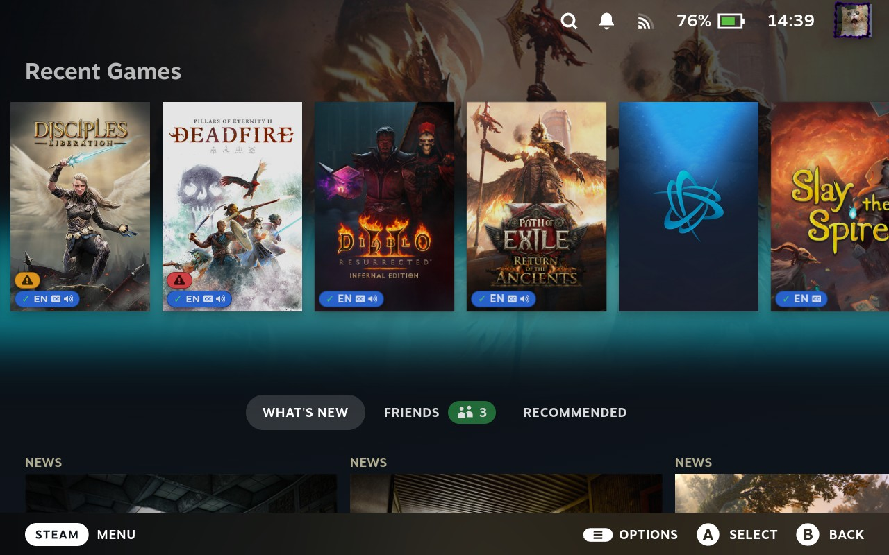
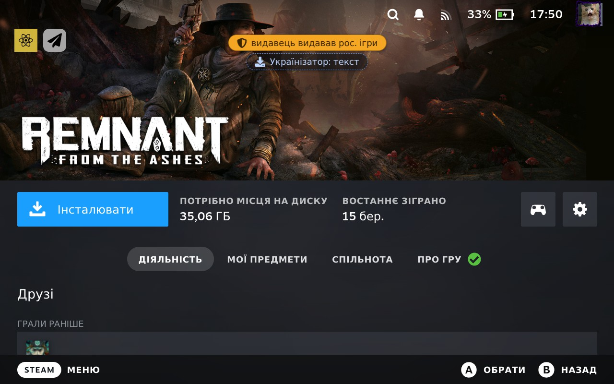
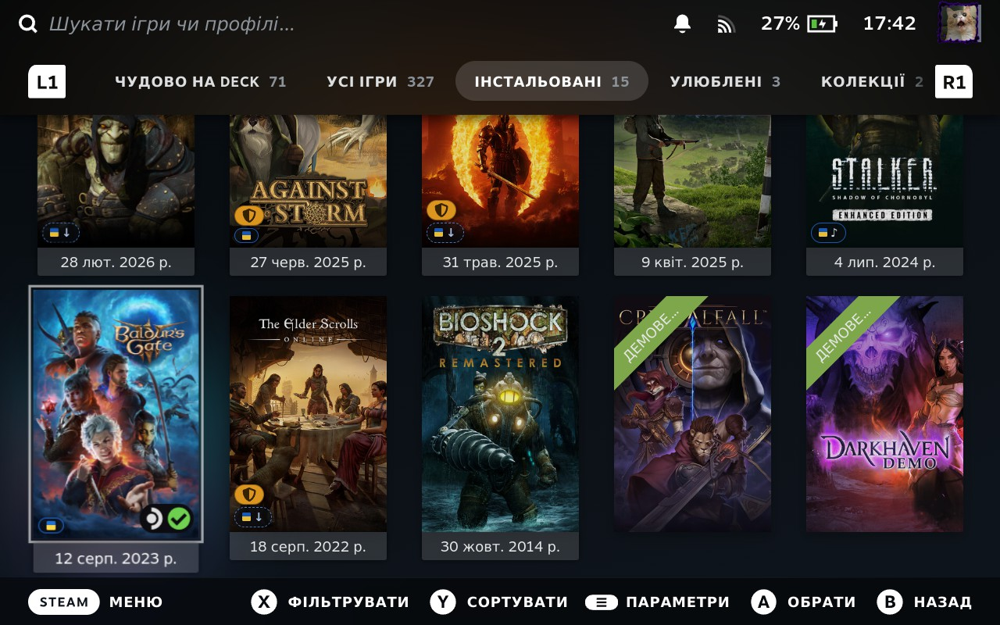
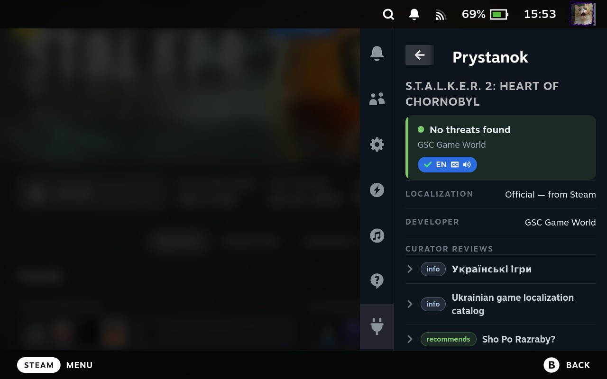
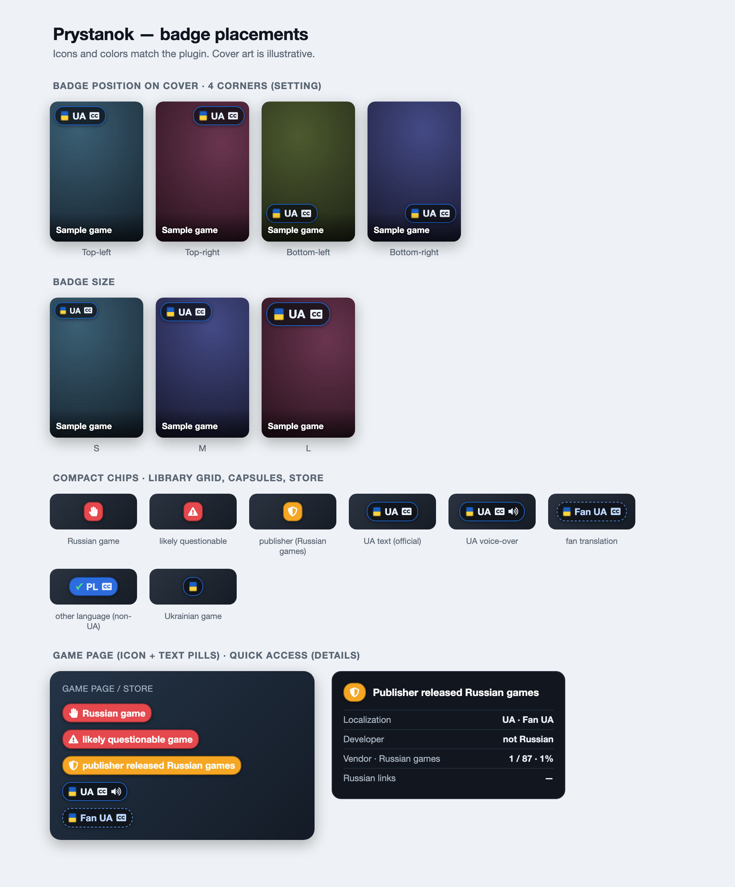

  
  <h1>Prystanok 🇺🇦</h1>

<a href="README.md">Українська</a> · <b>English</b>

A [decky-loader](https://github.com/SteamDeckHomebrew/decky-loader) plugin that surfaces, right in the Steam Deck UI:

- 🟦 **a localization badge** — whether a game has localization **in the language you pick in settings** (defaults to the Steam UI language). Official data comes from the local Steam cache (`appinfo.vdf`) — offline, for any language, split into text / subtitles / voice.
- 🟥 **a threat icon** (three levels): **"russian game"** — a game of russian origin (KULI) or whose **developer is a russian studio**; **"likely questionable game"** — a majority-russian publisher/vendor (>50% of the portfolio); **"⚠ publisher released russian games"** — russian games in the minority. Plus a separate signal for **russian links** (VK etc.). The threat badge is always shown;
- ⚠️ a warning when a Ukrainian game is sold in the russian region.

## Screenshots

<table>
  <tr>
    <td width="50%"> Steam store — overlays on capsules</td>
    <td width="50%"> Home — Recent Games grid</td>
  </tr>
  <tr>
    <td> Game page — threat badge + fan translation</td>
    <td> Library grid — compact overlays on covers</td>
  </tr>
  <tr>
    <td colspan="2"> Quick Access — full details: verdict, localization, developer, curator reviews</td>
  </tr>
</table>

All badge placements and variants:

## Where the icons appear

| Place | What it shows |
|---|---|
| Library game page | localization / threat badge; tap → details modal in the Steam UI (Prystanok / KULI buttons) |
| Library grid & home capsules | compact overlays ("UA", "UA ♪", "RU", "questionable", "publisher") on covers |
| Store (`store.steampowered.com`) | badge on the game page + overlays on list capsules; tap → in-page modal |
| Quick Access panel | full details (same as the modal): verdict, developer, vendor stats of russian games, russian links, Ukrainian curator reviews, "why it's wrong" |

The Quick Access panel shows details for the running game, a game open in the store, or the last one opened in the library.

## Settings

- **Surfaces** (capsules / game page / store) — toggled independently; per surface: position, size, offsets.
- **Localization** — global toggle for the loc badge, detail level (text/voice, official/unofficial) and **which language to look for** (defaults to the Steam UI language).
- The plugin's own label language also follows the Steam UI language (Ukrainian / English).
- The **threat** badge can't be turned off (it's the point of the plugin) — it shows even on a disabled surface (the "russian game" level only).

## How it works

- The Python backend queries `prystanok.com.ua/api/games/steam` in batches of up to 100 games, caches responses on disk (7 days; not-in-db → 1 day) and respects the rate limit (backoff on HTTP 429).
- **Official localization** is read offline from the local Steam cache (`appcache/appinfo.vdf`, v29 format) — fast, no rate limit, for every game and any language. Prystanok adds unofficial fan translations and threat data.
- **The threat level** is computed client-side (the API exposes no ready-made level): `russian` — `Origin == Russian` in KULI **or** the game's developer (from `Metadata.Developers`) has a dev portfolio >50% russian; `suspect` — a vendor that's majority-russian overall (typically the publisher); `vendor` — russian games in the minority.
- **The store** on Deck is a separate web tab; the backend injects badges via the CEF debugger (like CSS Loader).
- Offline, the plugin serves cached data and stays out of the way.

## Credits

- [Ihrovyi Prystanok](https://prystanok.com.ua/) — API with data on games, publishers and localizations
- [KULI — catalog of Ukrainian game localizations](https://kuli.com.ua/)
- [ProtonDB Badges](https://github.com/OMGDuke/protondb-decky) — game-page patching pattern
- Built on the [decky-plugin-template](https://github.com/SteamDeckHomebrew/decky-plugin-template) (Steam Deck Homebrew)

## License

Code — [BSD-3-Clause](LICENSE). Icons — [Font Awesome Free 5](https://fontawesome.com/) (CC BY 4.0).
