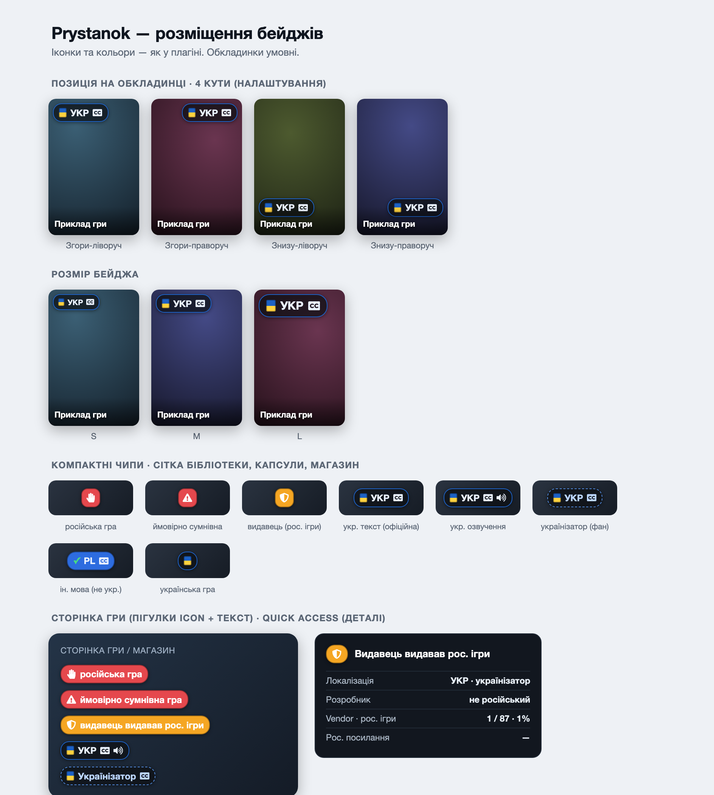

  
  <h1>Prystanok 🇺🇦</h1>

<b>Українська</b> · <a href="README.en.md">English</a>

Плагін для [decky-loader](https://github.com/SteamDeckHomebrew/decky-loader), який показує в інтерфейсі Steam Deck:

- 🟦 **бейдж локалізації** — чи має гра локалізацію **мовою, яку ти обрав у налаштуваннях** (за замовчуванням — мова інтерфейсу Steam). Офіційні дані беруться з локального кешу Steam (`appinfo.vdf`) — офлайн, для будь-якої мови, з розрізненням текст / субтитри / озвучення. **Додатково для української** показуємо сторонні (неофіційні) локалізації — українізатори з [Ігрового пристанку](https://prystanok.com.ua/) та [КУЛІ](https://kuli.com.ua/), з позначкою офіційна / напівофіційна / неофіційна. Для не-української цільової мови показується лише офіційна локаль зі Steam (напр. «PL»);
- 🟥 **іконку загрози** (три рівні): **«російська гра»** — гра російського походження (КУЛІ) або її **розробник — російська студія**; **«ймовірно сумнівна гра»** — видавець/вендор мажоритарно російський (>50% портфоліо); **«⚠ видавець видавав рос. ігри»** — рос. ігри в меншості. Плюс окремий сигнал про **російські посилання** (VK тощо). Бейдж загрози показується завжди;
- ⚠️ попередження, якщо українська гра продається в російському регіоні.

## Скріншоти

<table>
  <tr>
    <td width="50%"> Магазин Steam — оверлеї на капсулах</td>
    <td width="50%"> Головна — сітка Recent Games</td>
  </tr>
  <tr>
    <td> Сторінка гри — бейдж загрози + українізатор</td>
    <td> Сітка бібліотеки — компактні оверлеї на обкладинках</td>
  </tr>
  <tr>
    <td colspan="2"> Quick Access — повні деталі: вердикт, локалізація, розробник, рецензії кураторів</td>
  </tr>
</table>

Усі можливі розміщення та варіанти бейджів:

## Де показуються іконки

| Місце | Що показує |
|---|---|
| Сторінка гри в бібліотеці | бейдж локалізації / загрози; тап → модалка з деталями в Steam UI (кнопки «Пристанок» / «КУЛІ») |
| Сітка бібліотеки та капсули на головній | компактні оверлеї («УКР», «УКР ♪», «рф», «сумнівна», «видавець») на обкладинках |
| Магазин (`store.steampowered.com`) | бейдж на сторінці гри + оверлеї на капсулах у списках; тап → in-page модалка |
| Quick Access панель | повні деталі (той самий вигляд, що модалка): вердикт, розробник, vendor-статистика рос. ігор, російські посилання, рецензії українських кураторів, «чому це погано» |

Панель Quick Access показує деталі для запущеної гри, гри, відкритої в магазині, або останньої відкритої в бібліотеці.

## Налаштування

- **Поверхні** (капсули / сторінка гри / магазин) — вмикаються окремо; для кожної: позиція, розмір, відступи.
- **Локалізація** — глобальний тумблер бейджа локалі, деталізація (текст/озвучення, офіційна/неофіційна) та **яку мову шукати** (за замовчуванням — мова інтерфейсу Steam).
- Мова підписів плагіна теж іде за мовою Steam UI (українська / англійська).
- Бейдж **загрози** прибрати не можна (це суть плагіна) — його видно навіть на вимкненій поверхні (лише рівень «російська гра»).

## Як це працює

- Бекенд (Python) запитує `prystanok.com.ua/api/games/steam` батчами до 100 ігор, кешує відповіді на диску (7 днів; відсутні в базі — 1 день) і поважає rate limit (backoff на HTTP 429).
- **Офіційна локалізація** читається офлайн із локального кешу Steam (`appcache/appinfo.vdf`, формат v29) — швидко, без rate-limit, для всіх ігор і будь-якої мови. Пристанок додає неофіційні українізатори та дані про загрозу.
- **Критерій загрози** обчислюється клієнтськи (в API нема готового рівня): `russian` — `Origin == Russian` у КУЛІ **або** розробник гри (з `Metadata.Developers`) має dev-портфоліо >50% рос. ігор; `suspect` — вендор мажоритарно російський загалом (типово видавець); `vendor` — рос. ігри в меншості.
- **Магазин** на Deck — окремий веб-таб; бейджі туди вставляє бекенд через CEF-дебагер (як CSS Loader).
- Без інтернету плагін показує дані з кешу і не заважає роботі.

## Подяки

- [Ігровий пристанок](https://prystanok.com.ua/) — API з даними про ігри, видавців і локалізації
- [КУЛІ — каталог української локалізації ігор](https://kuli.com.ua/)
- [ProtonDB Badges](https://github.com/OMGDuke/protondb-decky) — патерн патчингу сторінки гри
- Побудовано на [decky-plugin-template](https://github.com/SteamDeckHomebrew/decky-plugin-template) (Steam Deck Homebrew)

## Ліцензія

Код — [BSD-3-Clause](LICENSE). Іконки — [Font Awesome Free 5](https://fontawesome.com/) (CC BY 4.0).
